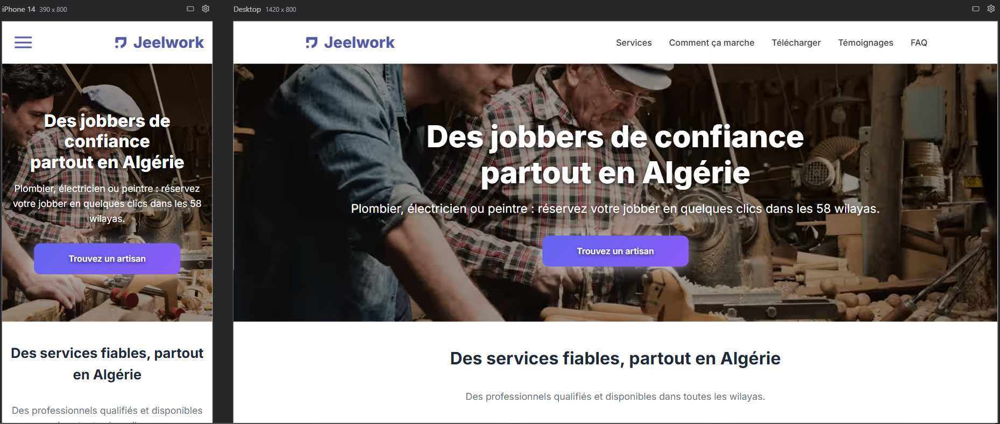

# 🛠️ Jeelwork Landing Page

Official landing page for **Jeelwork Algeria** – a platform that connects users with skilled local jobbers and service providers across all 58 wilayas (cities).

Built using **Next.js 15** with the **App Router** and **TypeScript**, the project is optimized for:
- ⚡ SEO and performance (static export, responsive images, lazy loading)
- 📱 Mobile-first responsive design
- ♿ Accessibility best practices
<!--
- 🌍 Multi-language readiness
-->

> This project serves as the front-facing gateway for the Jeelwork ecosystem.

🔗 [https://www.jeelwork.com](https://www.jeelwork.com)

<br><br>

## 🖼️ Preview



<br><br>


## 🚀 Getting Started

### Prerequisites

Make sure you have the following installed:

- [Node.js](https://nodejs.org/) (v18+ recommended)
- [npm](https://www.npmjs.com/) or [pnpm](https://pnpm.io/) or [yarn](https://yarnpkg.com/)
- Git with SSH access configured if cloning via SSH

### Installation

Clone the repository and install dependencies:

```bash
git clone git@github.com:nadir-ammisaid/jeelwork-landing-page.git
cd jeelwork-landing-page
npm install
```

### Development server
To run the dev server locally: 

```bash
npm run dev
```

Visit http://localhost:3000 in your browser.

<br><br> 


## 🧱 Project Structure

This project uses **Next.js App Router** with the following structure:

```
JEELWORK-LANDING-PAGE
├── .next/                          
├── node_modules/                   
├── public/
│   ├── icons/                      
│   ├── images/                     
│   ├── manifest.json               # PWA manifest
│   ├── robots.txt                  # SEO robots file
│   └── sitemap.xml                 # SEO sitemap
├── src/
│   ├── app/
│   │   ├── (legal)/                
│   │   │   ├── privacy-policy/
│   │   │   │   ├── page.tsx
│   │   │   │   └── privacy-policy.css
│   │   │   └── terms-of-use/
│   │   │       ├── page.tsx
│   │   │       └── terms-of-use.css
│   │   ├── apple-icon.png          # Apple touch icon
│   │   ├── criticalStyles.css.ts   # Critical CSS (string)
│   │   ├── criticalStyles.tsx      # <CriticalStyles/> component
│   │   ├── favicon.ico
│   │   ├── globals.css             # Global styles
│   │   ├── icon.png                
│   │   ├── layout.tsx              # Root layout (metadata, <head/>)
│   │   ├── page.module.css         
│   │   └── page.tsx                # Homepage (landing)
│   └── components/                 # Landing page sections
│       ├── CTASection.tsx
│       ├── DownloadSection.tsx
│       ├── FAQSection.tsx
│       ├── Footer.tsx
│       ├── Header.tsx
│       ├── HeroSection.tsx
│       ├── HowItWorksSection.tsx
│       ├── ServicesSection.tsx
│       └── TestimonialsSection.tsx
├── .gitignore
├── next-env.d.ts
├── next.config.ts
├── package-lock.json
├── package.json
├── README.md
└── tsconfig.json
```


<br><br>


## ✨ Features

- ✅ Static Site Generation (SSG) for fast load time
- 🔒 SEO and security headers configured in `next.config.ts`
- 📱 Mobile-first responsive design
- 🧑‍💻 Accessible markup (ARIA roles, keyboard navigation)
- ⚡ Optimized fonts & images (`next/image`, `sharp`, font-display swap)
- 🧭 Anchor navigation with smooth scrolling


<!--
- 🌓 Dark mode support (via prefers-color-scheme)
- 🌍 Fully translated content (French + English routes)
-->


<!-- Default Readme 

This is a [Next.js](https://nextjs.org) project bootstrapped with [`create-next-app`](https://nextjs.org/docs/app/api-reference/cli/create-next-app).

## Getting Started

First, run the development server:

```bash
npm run dev
# or
yarn dev
# or
pnpm dev
# or
bun dev
```

Open [http://localhost:3000](http://localhost:3000) with your browser to see the result.

You can start editing the page by modifying `app/page.tsx`. The page auto-updates as you edit the file.

This project uses [`next/font`](https://nextjs.org/docs/app/building-your-application/optimizing/fonts) to automatically optimize and load [Geist](https://vercel.com/font), a new font family for Vercel.

## Learn More

To learn more about Next.js, take a look at the following resources:

- [Next.js Documentation](https://nextjs.org/docs) - learn about Next.js features and API.
- [Learn Next.js](https://nextjs.org/learn) - an interactive Next.js tutorial.

You can check out [the Next.js GitHub repository](https://github.com/vercel/next.js) - your feedback and contributions are welcome!

## Deploy on Vercel

The easiest way to deploy your Next.js app is to use the [Vercel Platform](https://vercel.com/new?utm_medium=default-template&filter=next.js&utm_source=create-next-app&utm_campaign=create-next-app-readme) from the creators of Next.js.

Check out our [Next.js deployment documentation](https://nextjs.org/docs/app/building-your-application/deploying) for more details.

 -->